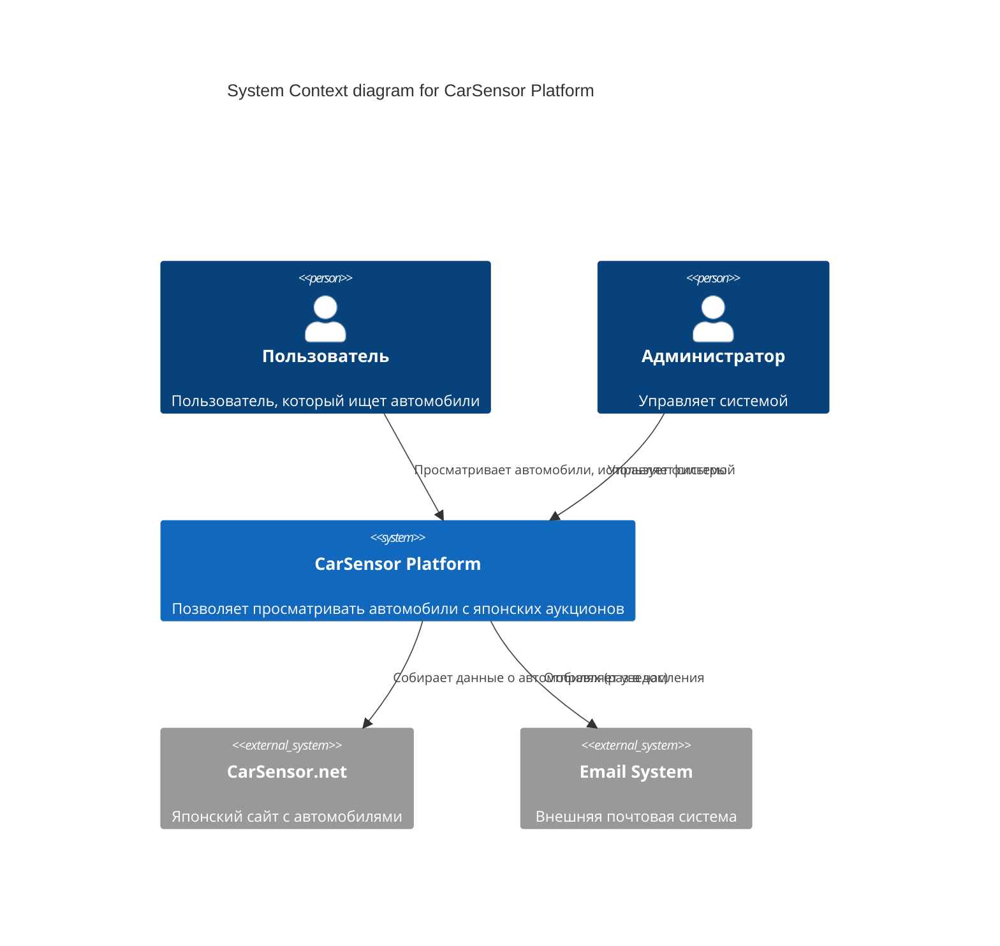
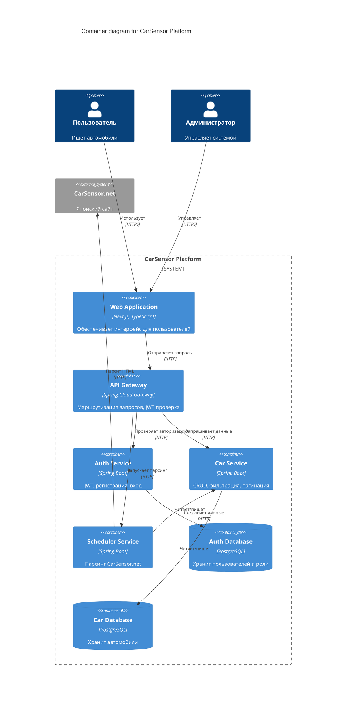
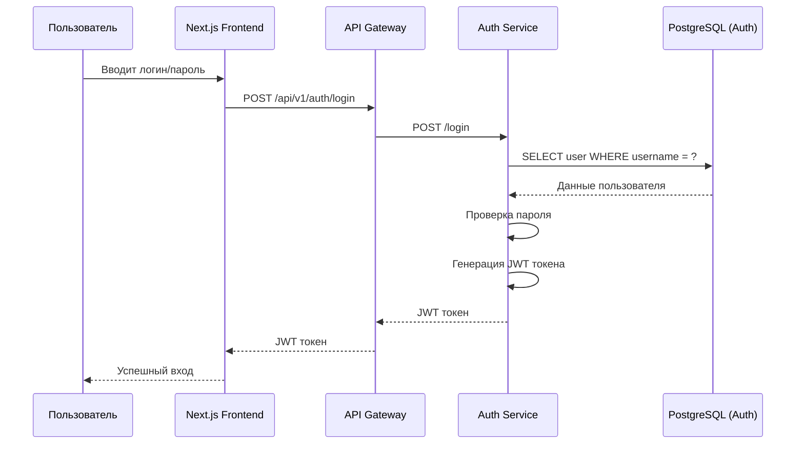
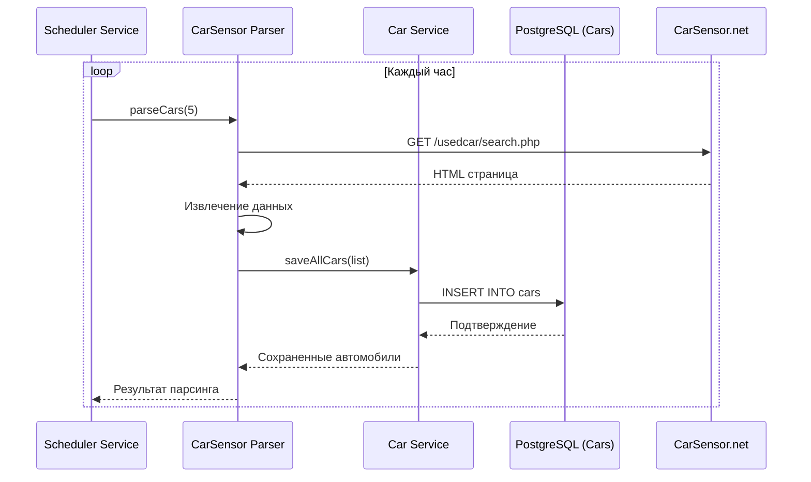
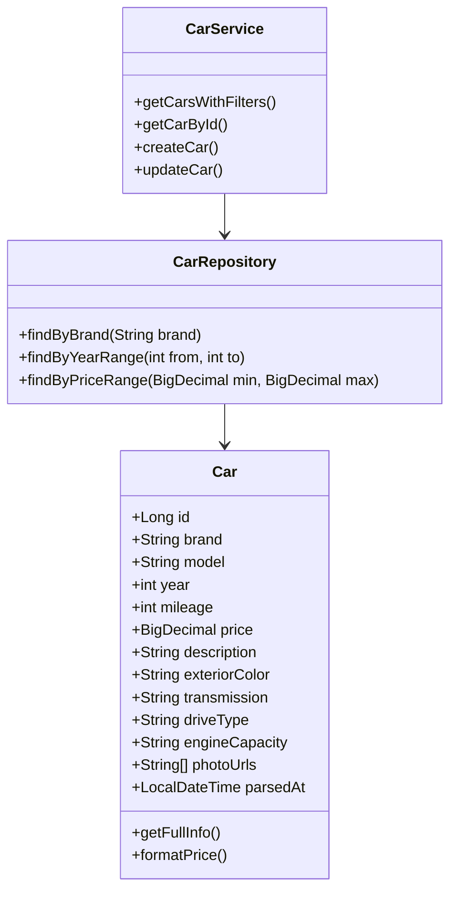
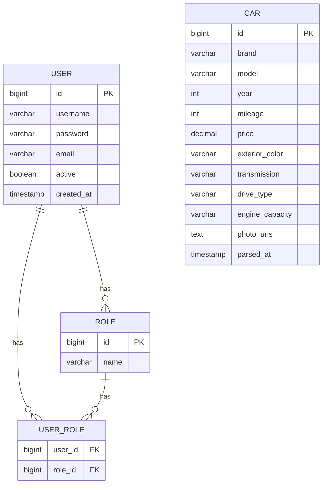
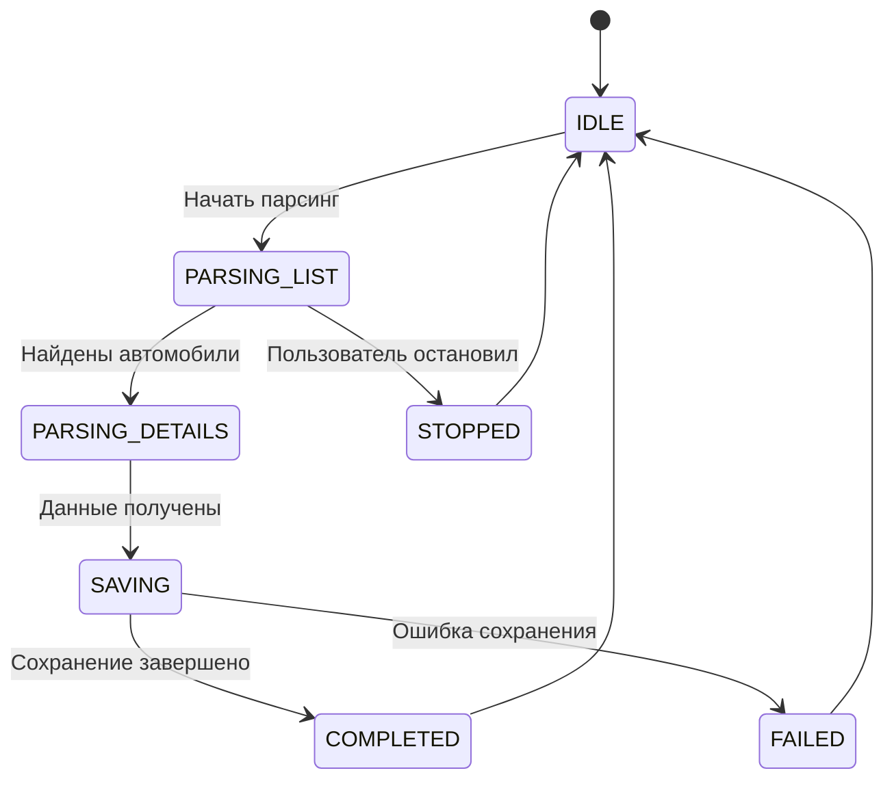

# Архитектурные диаграммы CarSensor Platform
## 1. Диаграмма контекста (C4 Level 1)
Общий обзор системы и взаимодействие с внешними пользователями и системами.

## 2. Диаграмма контейнеров (C4 Level 2)
Микросервисная архитектура и взаимодействие между сервисами.

## 3. Диаграмма последовательности для авторизации (UML Sequence)

## 4. Диаграмма последовательности для парсинга (UML Sequence)

## 5. Диаграмма развертывания (Deployment)

## 6. Диаграмма классов (сущность Car)

## 7. ER-диаграмма (База данных)

## 8. Диаграмма состояний парсинга

## 📊 Легенда
```text
---------------------------------------------------------------------
|Иконка|       Элемент        |                Описание             |                         
|:----:|:--------------------:|:-----------------------------------:|
|  🧑  | **Пользователь**     | Внешний пользователь системы        |
|  🖥️  | **Сервис**           | Микросервис (Spring Boot)           |
|  🗄️   | **База данных**      | PostgreSQL хранилище               |
|  🌐  | **Внешняя система**  | CarSensor.net и другие внешние API  |
|  🔄  | **Поток данных**     | Направление взаимодействия          |
--------------------------------------------------------------------|
```
## 📝 **Как использовать**
```bash
1. Просто скопируйте этот код в файл `diagrams.md`
2. GitHub автоматически отобразит все диаграммы
3. В VS Code установите плагин **Markdown Preview Mermaid Support**
```